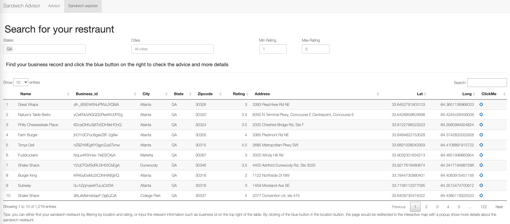

# YelpDataAnalysis
This project will focus on Sandwich restaurants with data from Yelp, and the target is to analyze the reviews and provide data-driven suggestions to business owners. Specifically, it will categorize all the reviews by topic, and for each sandwich business, find out the reasons why they have received good reviews or bad reviews. Consumer behaviors and preferences are discussed in this project in order to provide businesses with unique business strategies in different seasons.
<!-- *** -->
<!-- Group 5, Module 3, YelpDataAnalysis -->
***

## Table of Contents
  - [Dependencies](#dependencies)

  - [Installation](#installation)

  - [File Description in Code Folder](#file-description-in-code-folder)

  - [Web-based APP](#web-based-app)
  
  - [Acknowledgments](#acknowledgments)

  
  - [Contributors](#contributors)


***
## Dependencies
- [Python 3.6+](https://www.python.org/)
- [R 4.0+](https://www.r-project.org/)
- [R Shiny](https://github.com/rstudio/shiny)(Shiny is supported on the latest release version of R, as well as the previous four minor release versions of R)


## Installation
These commands assume that your Python version is 3.6+ and basic  Python libraries for Machine Learning are already installed.
It may be available as `pip` depending on how your system is configured.
```bash
# [OPTIONAL] Activate a virtual environment
pip install pyldavis
pip install nltk
```
This project depends upon a knowledge of  the packages in R, You can install with:
```
if (!require(devtools))
  install.packages("devtools")
devtools::install_github("rstudio/leaflet")
```


## File Description in Code Folder
- [data_cleaning.py](code/data_cleaning.py) - Python code for cleaning the text data. Include sifting text based on its content, removing symbols, and lemmatization.
- [lda_analysis.py](code/lda_analysis.py) - Python code for transferring the text data into dictionary and corpus and then building the LDA models.
- [business_analysis.py](code/lda_analysis.py) - Python code for analyzing the outcome of the LDA model like finding the topic distribution of each review.
- [visualization.py](code/visualization.py) - Python code for visualizing the outcome of LDA model such as drawing par plot. 


## Web-based APP

[Shiny APP Link](https://ouyangxu.shinyapps.io/YelpShiny/)

### Preview:


## Acknowledgments
This is a project of STAT 628 Fall 2021 at UW-Madison, supervised by Prof. Hyunseung Kang.


## Contributors
- **Shuren He** - (she249@wisc.edu): Contribute to most of the LDA model including selecting and training model.
- **Ziyue Zheng** - (zzheng232@wisc.edu): Contribute to the t-test part, the analysis of the LDA model outcome, R Shiny app, report writing.
- **Ouyang Xu** - (oxu2@wisc.edu): Contribute to part of the LDA model, R Shiny app, Github construction, report writing.


